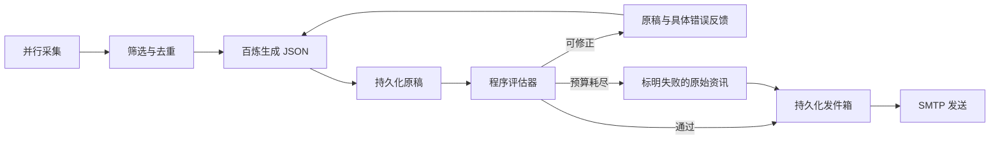

# 英伟达与腾讯每日邮件

公开资讯 → 百炼中文摘要 → 证据检查与修正循环 → QQ 邮件。默认北京时间 09:00，每家公司最多 8 条。仅使用公开资料，不读取内部邮件或研报。

## 首次配置

1. Python 3.11+：`python -m venv .venv`，再执行 `.venv\Scripts\python.exe -m pip install -e ".[dev]"`。
2. 将 `daily.example.json` 复制为 `daily.local.json`，填写 sender 和 recipient。个人邮箱只放本机配置，不提交 Git。
3. 在百炼北京地域创建通用 API Key；选仍有免费额度、支持非思考 JSON 输出的模型，默认 `qwen-plus`。免费额度有有效期，不是永久免费 API。
4. 在该模型开启“免费额度用完即停”，等待配置生效。程序无法查询此开关，配置字段只是用户确认，不能替代服务端设置。
5. QQ 邮箱设置中开启 SMTP，生成授权码。使用授权码，不是登录密码。
6. 双击 `configure_daily.cmd`，通过不回显的提示输入密钥。脚本随后测试真实百炼调用与 SMTP 登录，不发送测试邮件。

Windows 凭据使用当前用户 DPAPI 加密，保存到 `data/daily/credentials.dpapi`，换机器或用户需重新配置。项目在同步盘下时，数据可能随同步盘上传。非 Windows 使用 `DASHSCOPE_API_KEY`、`SMTP_PASSWORD` 环境变量，不运行 DPAPI 向导。

```powershell
# 本地检查；加 --live 测试百炼和 SMTP 登录
.venv\Scripts\python.exe -m research_agent.daily check --live
# 真实采集 + 本地 HTML / TXT / JSON 预览；已配置时会调用模型
.venv\Scripts\python.exe -m research_agent.daily run
# 实际发送；同日重跑跳过；加 --due 在早于配置时间时跳过
.venv\Scripts\python.exe -m research_agent.daily run --send --due
.venv\Scripts\python.exe -m research_agent.daily status
.venv\Scripts\python.exe -m research_agent.daily trace
```

全局 `--config` 在子命令前。数据目录相对配置文件解析。密钥不能写到命令行参数里。

## 定时运行

本次在用户的 Codex 当前任务中创建每天北京时间 09:00 的本地自动化，执行 Python CLI。调度配置不随 Git 仓库迁移。电脑、Codex、网络需要可用；并非已经部署到持续运行服务器，不能保证休眠期间准时发送。凭据缺失时明确报告阻塞。

其他部署环境可调度同一 CLI。不要同时启动多个使用不同数据目录的实例，否则无法共享防重记录。只有 `--send` 才发送邮件。

## 采集与内容选择

四源并发：NVIDIA 官方 RSS、腾讯官网新版中文新闻列表、Google News 的 NVIDIA 和腾讯检索 RSS。每源最多 3 MB，整体超时 40 秒，最多解析 150 条 RSS。禁止 XML DTD/实体，结构变化报错。

- 默认回看 36 小时，排除未来记录。腾讯列表只给日期，按北京时间零点处理并注明精度。
- Google 标题必须出现公司/产品别名，减少“腾讯是发布媒体”的无关新闻；可能漏掉间接指代。
- 按官方、有限媒体优先表、业务关键词、时间排序。是可解释筛选规则，不代表真实投资重要性。
- 先排除已发送 URL，再限额；按 URL 和规格化标题去重，不能保证识别所有同事件改写。
- 官方域名允许补充正文，最多保存 12000 字符，模型最多看到每篇前 5000 字符。Google 条目通常只有标题/订阅摘要，邮件明确注明，不冒充阅读了全文。
- 每源状态随邮件展示。Google 在某些网络不可达；全源失败时发送故障说明。没有窗口内的官方新闻不等于公司没有动态。

## Agent loop 技术细节

实现是受控的生成—检查—修正循环，状态由 Python 控制，模型负责摘要。没有开放式任意搜索或命令执行，也不以“最先进”作为未经测量的能力声明。



| 机制 | 实现与边界 |
|---|---|
| Structured output | 百炼 Chat Completions JSON mode、关闭思考模式、Pydantic 严格校验。JSON mode 本身不保证 Schema 或语义 |
| Evaluator / repair | ID 完整且不重复；引文必须来自对应文章；摘要不得新增数字；有限中文限定语不能丢失。一次反馈全部 Schema 和证据错误，包含上一稿、字段位置和允许的枚举值，最多修正一次 |
| 金额等值校验 | Decimal 精确换算英文 billion/million/B/M 与中文亿/万，比较币种、正负号和实际金额。`$8B` 可对应 `80亿美元`，不能对应 `8亿美元` 或 `80亿港元`。裸 `$` 按美元解析；没有币种的原文不接受补写币种 |
| 部分成功 | 修正预算耗尽时按条重验，保留通过的摘要；不通过或 ID 重复的条目仅展示原文，并在邮件主题和正文标明不完整 |
| Checkpoint / resume | SQLite 保存 calling/review/generate/done/failed。调用前预留预算，返回后保存原稿；检查可重复执行。相同资料、模型、端点、提示词与版本复用结果 |
| 调用预算 | 每个内容检查点最多 2 次生成，每次最多 3 次 HTTP 尝试。401/403 不换模型或供应商；429、部分 5xx、网络错误有限退避。输出上限 6000 tokens |
| Tool boundary | 只抓预置源和允许的官方正文域名；拒绝跨域重定向。网页与模型无权修改收件人或发信流程 |
| 可观测性 | trace 查看阶段、次数、修正原因；报告记录已知 token 用量；日志不输出密钥 |
| Evals | 注入引用/数字/限定语错误、进程中断、配额拒绝、SMTP 断线，验证实际故障行为 |

检查器不是第二个 LLM，自检通过不能证明语义完全正确。英文限定语、非金额单位关系、同一事件矛盾仍需人工复核。采集阶段没有逐源持久化恢复，重新采集导致输入变化时会生成新检查点。失败或进程中断时未知的服务端 token 消耗无法准确计入；正常响应用量累计保存。

## 发信事务与恢复

`daily.sqlite3` 独立于旧材料库。outbox 保存邮件与状态；delivered 保存各收件人已发送链接；news_checkpoints 保存摘要原稿及阶段；news_trace 保存决策轨迹。OS 文件锁阻止同目录并发运行。

| 状态 | 含义 | 重跑 |
|---|---|---|
| prepared | 内容已持久化，未提交发送 | 可以重试登录及连接 |
| sending | 已记录发送意图，可能正在传输 | 暂停，核对收件箱 |
| sent | SMTP 已接受并记录链接 | 同日跳过；不代表一定进收件箱 |
| unknown | 传输中断，不能确认接收 | 暂停，禁止盲目重发 |

Message-ID 按日期与收件人稳定生成。SMTP 无跨系统事务，不能承诺严格 exactly-once；不确定时暂停，优先避免重复。

```powershell
# 核对收件箱和垃圾箱后记录结论
python -m research_agent.daily resolve RUN_ID --outcome received
python -m research_agent.daily resolve RUN_ID --outcome not-received
# 确认未收后，同日运行 --send 可重试
```

prepared 重跑复用原邮件。当前不自动补发跨日旧邮件，status 中保留未解决记录。

## 官方参考与验证范围

- [百炼免费额度与用完即停](https://help.aliyun.com/zh/model-studio/new-free-quota)
- [百炼兼容接口和地域](https://help.aliyun.com/zh/model-studio/compatibility-of-openai-with-dashscope)
- [千问 JSON 输出](https://help.aliyun.com/zh/model-studio/qwen-structured-output)
- [NVIDIA RSS](https://nvidianews.nvidia.com/rss) · [腾讯新闻](https://www.tencent.com/zh-cn/newsroom/all-news/)
- [生成—评估循环设计参考](https://www.anthropic.com/engineering/building-effective-agents)

2026-09-21 本机真实采集四源成功，生成两家公司各 8 条资讯。已接通真实百炼 qwen-plus，现场发现并修复枚举错误反馈不足、金额换算误报及整批失败丢弃有效摘要的问题。SMTP 仍需要单独验证，模型接通不代表邮件已投递或语义质量全面验收。远端 CI 以 GitHub Actions 对应提交结果为准。
