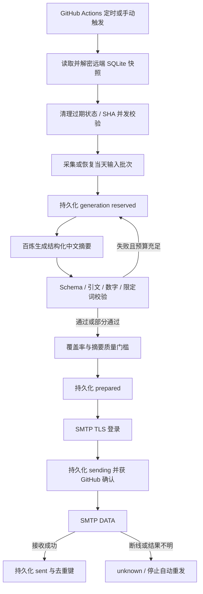

# 云端投研 Agent：架构、问题记录与运维手册

## 服务边界

这是面向一个邮箱、两家公司的生产化部署版本，核心程序使用 Python。
它具备真实采集、受约束的模型调用、校验与修正循环、远端检查点和持久化发件状态。
不能仅凭自动测试把它称为已经通过企业生产验收：没有高可用调度 SLA、平台外独立值班告警、
多租户隔离、SSO/RBAC 或人工投研事实审核。原始正文覆盖也不完整。

GitHub Actions 在北京时间 09:00 触发，09:20 再检查一次；已发送时不会重复发送。
GitHub 明确说明 schedule 可能延迟甚至丢弃，公开仓库长期无活动也可能停用定时工作流。
因此是“9 点开始调度”，不是邮件严格 9 点整到达。确有硬时限需求时应迁移到有 SLA 的调度器。

## 架构与关键不变量

1. **先持久化，后发信。** 远端保存失败、超时或响应不确定时，不执行后续 SMTP DATA。
2. **不确定不重发。** 任意日期存在 sending/unknown，都阻止下一封自动邮件，需核对收件箱。
3. **不把缓存当数据库。** 状态保存于独立 `codex/daily-state` 分支的 `state.enc`；不用会过期的 Actions cache/artifact 维护投递账本。
4. **密文可公开，密钥不公开。** SQLite 一致性备份经 gzip 压缩、Fernet 认证加密；密钥保存在 Actions Secrets。
   加密载荷绑定版本和仓库名，解密失败、仓库不符、数据库损坏或文件缺失时直接停止。
5. **拒绝并发覆盖。** 工作流 concurrency 防止主动并发；Contents API 的文件 SHA 提供乐观并发检查。
   冲突不会读取新 SHA 后强行覆盖，避免把新账本回滚。
6. **有界执行。** 同一输入最多两次生成，每次 HTTP 最多三次尝试；外层工作流最多 15 分钟。
   每次模型调用前的预算预留也同步到远端。所有来源成功时冻结当天输入批次，重启不会因新闻刷新重置该批次预算。
   采集降级时允许补跑重新采集，因此这不是跨所有输入的严格每日 token 硬上限。
7. **临时错误可恢复，但预算不退还。** 网络超时、429、500/502/503/504 在第一次生成失败后保存 retryable，
   当前运行结束；下次运行使用剩余的一次生成预算。403 等鉴权/额度错误保持 failed，不自动反复尝试。
   同样识别 v0.4.0 保存的临时失败，兼容既有检查点；不清空记录、不重置调用次数。
8. **质量按公司核对。** 每家公司有新增条目时，其通过摘要数至少占 50%；不能用 8 条英伟达摘要弥补 0 条腾讯摘要。
   没有新增条目的公司若存在失败来源，也不能把它当作“没有新闻”。摘要 ID 必须唯一且属于采集条目。

SMTP 无事务性幂等接口，无法保证数学意义的 exactly-once。崩溃可能发生于远端写入 sending 后、
SMTP 调用前，也可能发生于服务器接收后、sent 保存前；两者都保守归为不确定。
这会牺牲自动恢复率来降低重复发送风险。SMTP accepted 只代表服务器接收，不是最终入箱凭证。

## 真实遇到的问题与处理

| 问题 | 根因 | 处理 | 验证方式 |
|---|---|---|---|
| HF 上传代码后无法启动 | 新 Docker/Gradio 服务受账号付费套餐限制；错误最初只提示 CPU quota | 核对账号创建页；恢复为排查而暂停的旧实例；把任务执行迁到 GitHub | 云端 verify、迁移试发、收件核对 |
| HF 不能给 QQ 直接发邮件 | 出站仅允许 80/443/8080，不包含 SMTP 465 | QQ SMTP 在 Actions runner 运行；HF 不保存邮箱授权码 | 云端真实 SMTP TLS 登录与试发 |
| 换机器后丢失“今天已发”记录 | 原 SQLite 仅位于本机磁盘 | 加密快照 + 独立状态分支；首次导入现有已发记录 | 新 runner 恢复测试、同日重跑去重 |
| 发信后连接中断可能重复 | SMTP 接收和数据库提交不能原子完成 | sending 必须先远端确认；unknown 禁止自动重试；人工对账入口 | 注入 DATA 后断线、远端提交失败 |
| 两个任务覆盖状态 | 同时从同一旧快照开始 | workflow concurrency + 文件 SHA CAS；冲突立即失败 | 双写者故障测试 |
| 新闻转载占满条数 | 标题带不同媒体后缀，URL 也不同 | 去掉发行媒体后缀，Unicode 归一化，跨来源/跨天保存标题去重键 | 相同事件的不同来源标题回归用例 |
| 腾讯娱乐、粉丝或社区宣传混入 | 原查询只要求包含腾讯关键词 | 噪声词过滤并保留有营收/财报等财务关键词的相关条目 | 娱乐噪声与影视营收正例测试 |
| 模型省略限制、枚举非法、金额单位转换错误 | 提示无法保证结构和证据一致 | Pydantic Schema、逐条引文归属、数字币种尺度校验、带具体错误的有限修正 | 模型协议测试、金额/引文负例与真实模型调用 |
| 部分来源失效时误显“无新闻” | 空结果和抓取失败被混淆 | 按公司至少一个健康来源；空结果且来源失败时禁止发信；摘要通过率低于 50% 禁止发信 | 质量门槛测试、降级信息与运行摘要 |
| 测试 Windows 快照文件删不掉 | SQLite 连接上下文只提交事务，不自动 close | 显式 closing；快照使用 backup API 包含 WAL 内容 | Windows/Linux CI 与恢复读取测试 |

去重是归一化标题匹配，不保证识别所有改写转载；噪声过滤是可解释规则，不是完整新闻分类器。
数字与引用检查不能证明整句摘要语义被原文蕴含。涉及决策的内容仍需人工阅读原文。

## Secrets 与最小权限

仓库 Secrets：`DASHSCOPE_API_KEY`、`SMTP_PASSWORD`、`DAILY_CONFIG_JSON`、`STATE_ENCRYPTION_KEY`。
`GITHUB_TOKEN` 由每次任务临时签发，不保存个人 PAT。发信工作流仅需 `contents: write` 用于状态分支。
CI 仅读，PR 测试不注入业务密钥；checkout 不持久化 Git 凭据；Actions 固定到官方提交 SHA；依赖使用版本约束锁文件。
配置 JSON 包含收发件人地址，因此也用 Secret。不上传明文数据库、邮件正文、原始模型输出、日志附件或本机 DPAPI 文件。

公开分支中仅有密文，Fernet 自带时间戳会透露写入时间。密钥一旦泄露，历史密文也可能被解密；
不能把它等同于企业 KMS。应保护仓库管理员账号、启用 MFA，生产组织部署时用专用仓库和独立密钥托管。
不要随意替换 `STATE_ENCRYPTION_KEY`：必须先解密旧快照、完整迁移后再轮换。

## 日常操作

GitHub → Actions → **Daily NVIDIA and Tencent research** → Run workflow。

| mode | 行为 |
|---|---|
| verify | 合成材料模型探测 + QQ TLS 登录，不发送邮件 |
| preview | 恢复状态、采集与模型处理，不发送；模型预算与检查点仍持久化 |
| status | 只读恢复远端状态，输出当天投递状态、各公司质量计数和未决投递；仅查看时不因逾期退出非零 |
| health | 与 status 相同，但当天 09:50 后缺少已发记录或存在任意未决投递时退出非零 |
| send | 正常每日投递，9 点前跳过，当天已发送则跳过 |
| send-test | 一天最多一次带“云端迁移验证”标记的独立试发，不改写正常日报的已发记录 |
| resolve | 仅处理明确的 sending/unknown；填写运行 ID 与 received/not-received |

对账步骤：先在收件箱、垃圾箱和已发送中查找主题与日期，再选择 received 或 not-received。
如果收到，标记 received 并记录去重键；确认未收到才选 not-received，然后显式触发 send。
旧日期未收到不自动补发旧稿，后续 send 根据当前日期生成新闻。
切勿删除状态分支、清空数据库或盲目重跑来绕过 unknown。

失败可在任务摘要看到状态、错误类别、耗时与代码版本；成功包含新闻数、已校验摘要数、健康来源数与模型用量。
部分降级产生 warning；硬失败返回非零。GitHub 失败邮件通知取决于账号通知设置，当前没有独立于 GitHub 的值班告警。
新增单独的 `Daily delivery health` 工作流，于北京时间 09:50 检查。只授予 contents: read，
仅注入加密状态密钥与配置，不注入模型/SMTP 密钥；不写远端快照、不调用模型、不补发邮件。
逾期缺少普通日报 sent 记录或任意日期存在 sending/unknown 时，检查失败，原因出现在 Actions 摘要。
试发邮件不能替代普通日报记录；sent 只证明 SMTP 接收或运维人工对账，不表示自动核验入箱。
该检查独立于发信工作流，但与其使用同一个 GitHub 平台；平台整体停摆或定时检查也被延迟时仍会漏报。
GitHub 失败邮件取决于账号通知设置，没有额外部署外部告警服务。

v0.4.1 的失败摘要会给出按公司的计数及白名单化模型错误码；不会输出原文、报告或原始异常内容。
另修复恢复当天冻结批次时只检查 URL、漏检查标题去重键的问题，避免已发转载重新消耗模型预算。

状态保留：已发送报表 30 天；跨天去重、模型检查点和采集批次 7 天；不确定投递不自动清理。
密文快照超过 750 KB 时停止，要求运维归档；Git 历史中的旧密文不会自动删除。
新 runner 每次恢复到全新 data/cloud 路径；目录已有数据库时拒绝覆盖。

## 上线验收与企业下一阶段

上线需依次通过：本地与 CI 故障测试 → 云端 verify → send-test → 收件箱确认 → 正常 send 返回 already_sent → 停用本机发送任务。

2026-09-21 已完成这一顺序的真实验收，业务代码版本 `fe67760`：

| 验收项 | 实际结果 |
|---|---|
| [云端连通性](https://github.com/chendi-Shi/chenxi/actions/runs/35572005331) | 百炼探测与 QQ SMTP TLS 登录均通过 |
| [真实云端试发](https://github.com/chendi-Shi/chenxi/actions/runs/35572131403) | 77.16 秒；4/4 来源健康；16 条资讯，15 条摘要通过；2 次生成，输入 5,033 / 输出 2,691 tokens |
| 入箱确认 | QQ 网页收件箱确认 15:17 收到“云端迁移验证”邮件；主题明确标记摘要不完整 |
| [同日重跑](https://github.com/chendi-Shi/chenxi/actions/runs/35572329102) | 新 runner 恢复已发记录，返回 already_sent，没有调用 SMTP 再发 |
| [跨平台 CI](https://github.com/chendi-Shi/chenxi/actions/runs/35571972965) | Windows/Linux × Python 3.11–3.14 八个组合通过；当时共 79 项测试 |
| 本机调度 | 旧每日任务已暂停；当前只有 GitHub 云端调度启用 |

这次模型故障有可复查的具体例子：来源写“募资6亿港元 市值64亿港元 腾讯套现1.7亿”，
模型把最后一项改成“腾讯套现1.7亿港元”。不能把相邻金额的币种推断成该笔金额币种，
校验器两轮都拒绝这一摘要；邮件保留原文并说明降级。该案例已补入回归测试。
第一轮还遗漏了 6 个 article_id，修正循环补全了这些条目。整个过程的阶段和错误原因保留在加密检查点里。

百炼使用已配置免费额度保护的 qwen-plus；免费额度不是永久无限调用。
额度耗尽或到期时停止模型调用，不自动切换付费模型；需要关注 Actions 失败状态并在百炼核对额度。

未来若服务扩大到多邮箱或严格时效，需要把状态层替换为 PostgreSQL 事务与独立队列、
用支持幂等请求的邮件服务、加独立监控/值班、备份恢复演练、访问审计和人工标注的摘要评测集。
本次不引入这些未部署的组件，也不把计划中的能力写作已上线。

参考：[GitHub 调度限制](https://docs.github.com/en/actions/reference/workflows-and-actions/events-that-trigger-workflows#schedule)、
[文件 SHA 更新协议](https://docs.github.com/en/rest/repos/contents)、
[Fernet 认证加密](https://cryptography.io/en/stable/fernet/)、
[HF 网络限制](https://huggingface.co/docs/hub/spaces-overview)。
